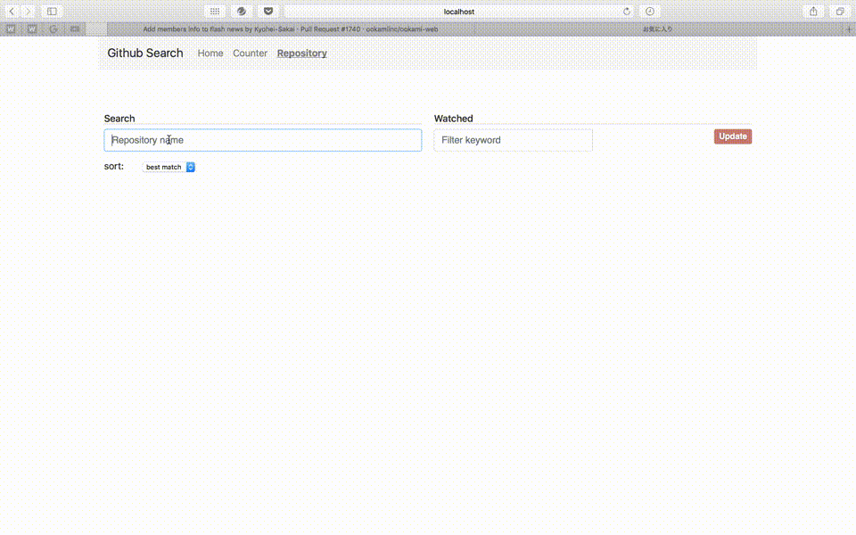
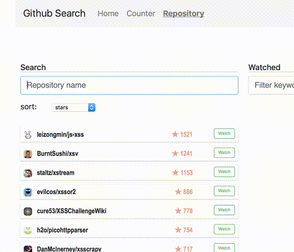
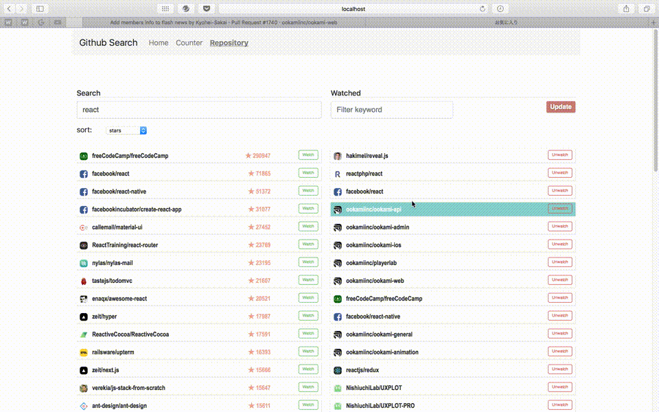

# Github Incremental Search React Redux

Wantedly インターン選考課題 [React]

## 開発にあたって

- [React Redux Starter Kit](https://github.com/davezuko/react-redux-starter-kit) をベースに作成
  - インターン先のWebアプケーションがこれをベースにしてるため

### 使用したフレームワーク・ライブラリ等
- [react-redux-starter-kit](https://github.com/davezuko/react-redux-starter-kit)
  - [react-redux](https://github.com/reactjs/react-redux)
  - [redux-thunk](https://www.npmjs.com/package/redux-thunk)
  - [redux](https://www.npmjs.com/package/redux)
  - [react-router](https://www.npmjs.com/package/react-router)
- [axios](https://www.npmjs.com/package/axios)
  - APIリクエスト
- [dotenv](https://www.npmjs.com/package/dotenv)
  - .envファイルで環境変数を管理
- [bootstrap](https://www.npmjs.com/package/bootstrap)
  - stylesでいくらか使用

#### package.json
```json
"dependencies": {
  "axios": "^0.16.2",
  "bootstrap": "^4.0.0-alpha",
  "compression": "^1.6.2",
  "dotenv": "^4.0.0",
  "express": "^4.14.0",
  "object-assign": "^4.1.1",
  "promise": "^7.1.1",
  "prop-types": "^15.5.10",
  "react": "^15.5.4",
  "react-dom": "^15.5.4",
  "react-redux": "^5.0.4",
  "react-router": "^3.0.0",
  "redbox-react": "^1.3.6",
  "redux": "^3.6.0",
  "redux-thunk": "^2.2.0",
  "whatwg-fetch": "^2.0.3"
},
```

## 動作説明

- ルートディレクトリで `$ npm start` を実行
- `http://localhost:3000/repository` にアクセス
  - Chromeだと一部レイアウトが崩れていたのでSafariの方がいいと思います
  - `/home`, `/counter` は React Redux Starter Kit のデフォルトページ

### Personal Access Tokenの設定
- `.env`

```
GITHUB_ACCESS_TOKEN=********
```

確認が取れなかったため以下の方法でお願いします

- `/src/constants/index.js`

```js
GITHUB_ACCESS_TOKEN: '********',
```

### State
- `searchedRepos`
  - SearchAPIのGET処理で取得したリポジトリ配列
- `searchWord`
  - インクリメンタルサーチの検索ワード
- `reqLimit`
  - SearchAPIのリクエスト状態にリミットがかかっているかどうか
- `sortParam`
  - SearchAPIのGET処理のオプションで使うsortパラメータ
- `watchedRepos`
  - WatchAPIのGET処理で取得したリポジトリ配列
- `filterWord`
  - Watchしているリポジトリ一覧をさらにフィルターをかけて表示するためのワード
- `filteredRepos`
  - Watchしているリポジトリからフィルターされて表示するリポジトリ配列

### Actions
- `CHANGE_SEARCH_KEYWORD`
- `CHANGE_SEARCHED_REPOS`
- `CHANGE_SEARCH_REQUEST_LIMIT`
- `CHANGE_SORT_PARAM`
- `DELETE_SEACHED_REPOS_LIST_ALL`
- `CHANGE_WATCHED_REPOS`
- `CHANGE_FILTER_KEYWORD`
- `CHANGE_FILTER_WATCHED_ROPOS`
- `DELETE_REPO_FROM_WATCHED_LIST`

### 主な操作・動作
- Searchエリア
  - テキスト入力によるインクリメンタルサーチ
    - 最大50件の取得・表示
  - selectボタンでsortパラメータを変更
  - `Watch`ボタンでリポジトリをWatch状態に変更（フィードバックなし）
    - 変更後、最新のWatchedリポジトリを取得

<p align="center"></p>
<p align="center"></p>

- Watchエリア
  - `Update`ボタンで最新のWatchedリポジトリを取得して表示
    - 最大100件を取得し、うち最大50件が表示される
  - `Unwatch`ボタンを押すとリストから消える
  - テキスト入力によりフィルターをかけて表示

<p align="center"></p>

## 工夫点
- SearchAPIのリミットに達した場合にアラートを表示
  - Access Tokenを使用した場合でも1分間に30リクエストまでであるため
- よりわかりやすいようにユーザのアバターを表示
- star数は重要な指標になるので表示

## 懸念点
- searchの方は自分がwatchしているかどうかに関係なく`Watch`ボタンが表示される
- `Watch`ボタンを押しても成功したかどうかわかりづらい
  - フィードバックがない
  - Watededリポジトリを更新するようにしているが、サーバー側で反映されるのが遅い
- Watchしているリポジトリを更新が最近の順に表示したいが、クエリパラメーターが用意されていない？
  - 何順なのかよくわからない
- ページネーション未対応
  - Watchしているリポジトリは1回リクエストで最大100件取得するようにしているが、すベて取得できるわけでない
- レスポンシブ未対応
  - 画面幅が小さいとリストのレイアウトが崩れる
